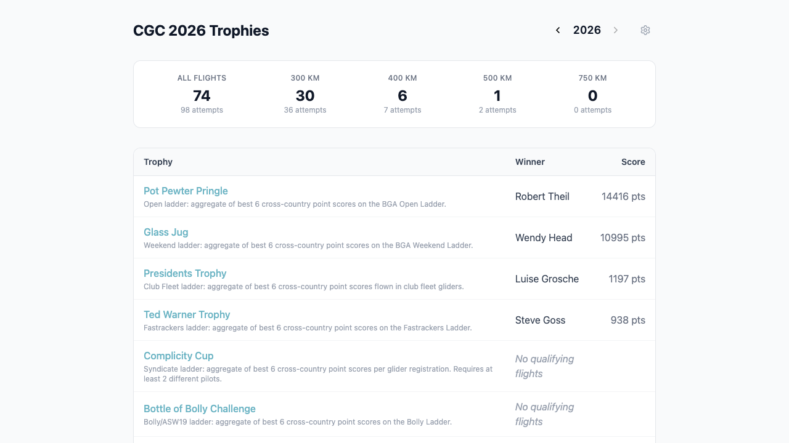

# Cambridge Gliding Centre Annual Trophies

A web app that works out the winners of [Cambridge Gliding
Centre](https://www.camgliding.uk/)'s annual cross-country trophies. It pulls
flight data for the season from the [BGA Ladder](https://www.bgaladder.net/),
scores each flight against the club's trophy rules, and shows the winners.

Live at **https://cgc-trophies.netlify.app**.



## How it works

1. The BGA Ladder publishes club flight data as CSV at `api.bgaladder.net`.
2. The client fetches and parses that CSV directly in the browser
   (`src/lib/fetchFlights.ts`) — there's no backend; it's a pure single-page app.
3. `useFlights` (+ SWR) loads the parsed data and filters to the club's home
   site.
4. The scoring engine (`src/lib/eval.ts`) evaluates each trophy's rules and
   produces the winners shown on the page.

All club-specific configuration — club details, season handling, and every
trophy definition — lives in **`trophies.config.ts`** at the project root, so
the app can be adapted to another gliding club by editing that one file.

### Trophy types

- **Flight trophies** — scored from a small DSL of `[op, ...args]` expressions
  (`filter` / `project` / `score` / `sort`) evaluated over the season's flights.
- **Ladder trophies** — group flights by pilot (or glider registration), take
  the top N by cross-country points, and sum the scores.

## Tech stack

Vite · React 19 · React Router · TypeScript · Tailwind CSS v4 · SWR · Vitest.
Tooling: **bun** (package manager + scripts), **Biome** (lint + format), and
**Node 24 LTS** pinned via `mise`.

## Getting started

Prerequisites: [bun](https://bun.sh) and [mise](https://mise.jdx.dev) (mise
provides the pinned Node version; see `mise.toml`).

```bash
bun install          # install dependencies
bun run dev          # start the dev server at http://localhost:3000
bun run build        # production build
bun run test         # run the test suite (Vitest) — note: not `bun test`
bun run lint         # Biome check (lint + format + import sorting)
bun run format       # Biome auto-fix
```

## Deployment

The app is a purely static single-page app, hosted on **Netlify** at
[cgc-trophies.netlify.app](https://cgc-trophies.netlify.app), with continuous
deploys from `main`. Build settings live in
[`netlify.toml`](netlify.toml): `bun run build` produces `dist/`, which is
published as-is, with an SPA fallback (`/* → /index.html`) so client-router
paths like `/admin` and `/trophy/:id` resolve on direct visits and refreshes.

To set up hosting from scratch: in the Netlify dashboard, **Add new site →
Import an existing project**, connect this GitHub repo, and deploy — Netlify
reads `netlify.toml`, so no manual build configuration is needed. Every push to
`main` then deploys automatically.

## Caveats

Results are automatic and derived entirely from the BGA Ladder, so they aren't
always the final word. Things we've run into:

- **Pilots changing clubs.** Updating a club on the BGA Ladder applies
  retroactively to all of that pilot's past flights, so they (and their past
  trophy wins) can disappear from the club's results.
- **"Novice"-type trophies.** Some trophies are restricted to pilots who
  haven't yet flown a given distance. The BGA Ladder has no notion of this, so
  we maintain a `pilotMilestones` list in `trophies.config.ts` (see below) —
  which needs manual upkeep.
- **Strict task rules.** A trophy limited to, say, "up to 3 turning points" is
  enforced exactly, even though an extra turnpoint added as a navigational aid
  might be acceptable in practice.
- **Missing uploads.** Flights that were never uploaded to the BGA Ladder
  can't be scored.

We also show only the **best qualifying flight per pilot** for each trophy — if
that flight turns out to be invalid, the next-best valid flight isn't shown.

Idea for the future: record historical winners explicitly, so results survive
flights vanishing from the BGA Ladder export and can override the algorithm's
idiosyncrasies.

## Managing pilot milestones

Some trophies are restricted to pilots who haven't yet achieved a distance
milestone (300km or 500km). The `pilotMilestones` section in
`trophies.config.ts` tracks which pilots achieved which milestones and when.
Trophies reference a milestone via `excludePilotsWithMilestone`, and all flights
from excluded pilots are filtered out.

Trophies with milestone exclusions:

| Trophy            | Milestone | Rule                                            |
| ----------------- | --------- | ----------------------------------------------- |
| The Boomerang     | 500km     | Excludes pilots who've completed a 500km flight |
| Double Century    | 300km     | Excludes pilots who've flown a 300km            |
| Slazenger Trophy  | 300km     | Excludes pilots who've flown a 300km            |
| Ted Warner Trophy | 300km     | Excludes pilots who've flown a 300km            |

A pilot is excluded from a season if their milestone year is **before** that
season (e.g. achieving 300km in 2024 means excluded from 2025 onwards, but still
eligible for 2024). A year of `0` means "always ineligible" — use this when the
milestone was achieved before we started tracking.

### Adding a pilot milestone

Use the helper script (run with bun):

```bash
# Achieved 300km in 2025
bun scripts/add-milestone.ts "Last, First" 300km 2025

# Always ineligible (year defaults to 0)
bun scripts/add-milestone.ts "Last, First" 500km
```

It adds the entry to `trophies.config.ts` and reformats it with Biome. It errors
if the pilot already exists in that milestone. Pilot names use `"Last, First"`
format, matching the BGA Ladder flight data.

## License

[MIT](LICENSE)
